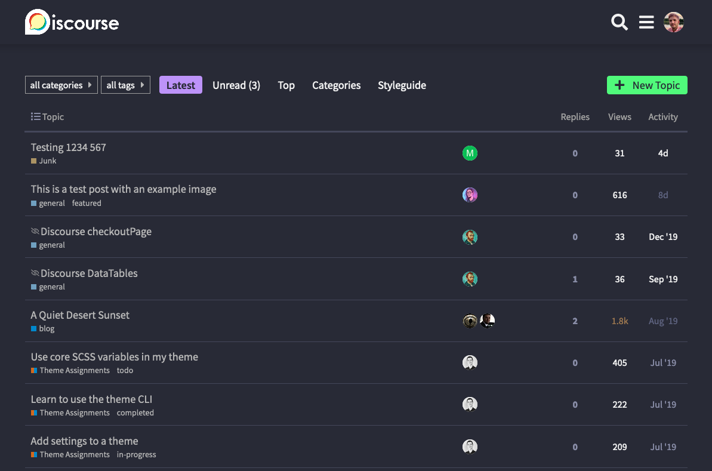

A theme built on the [Dracula color palette](https://draculatheme.com/contribute#color-palette). This color scheme has been one of my favorite go to themes in the text editors and other software I use. 

I felt like Discourse could use it as well :smile: 

Github Repo `https://github.com/jordanvidrine/discourse-dracula-theme`
 
:dark_sunglasses: [Preview on Theme Creator](https://theme-creator.discourse.org/theme/jordan.vidrine/dracula)

:hammer_and_wrench: [How do I install a theme or theme component?](https://meta.discourse.org/t/how-do-i-install-a-theme-or-theme-component/63682)