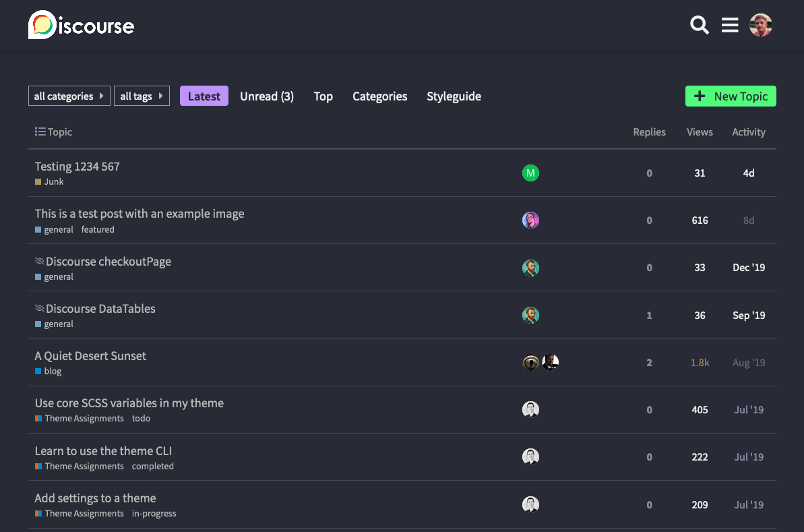

# Dracula for [Discourse](https://www.discourse.org/)

> A dark theme for [Discourse](https://www.discourse.org/)

## Install

All instructions can be found at [draculatheme.com/discourse](https://draculatheme.com/discourse).

## Team

This theme is maintained by the following person(s) and [these awesome contributors](https://github.com/dracula/discourse/graphs/contributors)

 |
--- |
[Jordan Vidrine](https://github.com/jordanvidrine)

## License

[MIT License](./LICENSE)